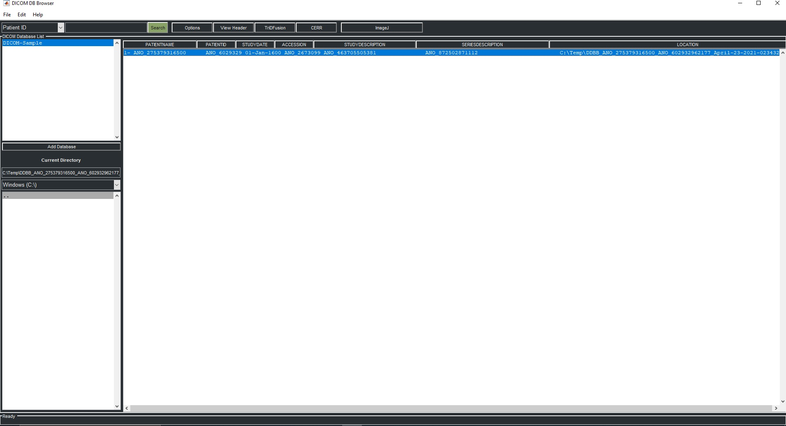
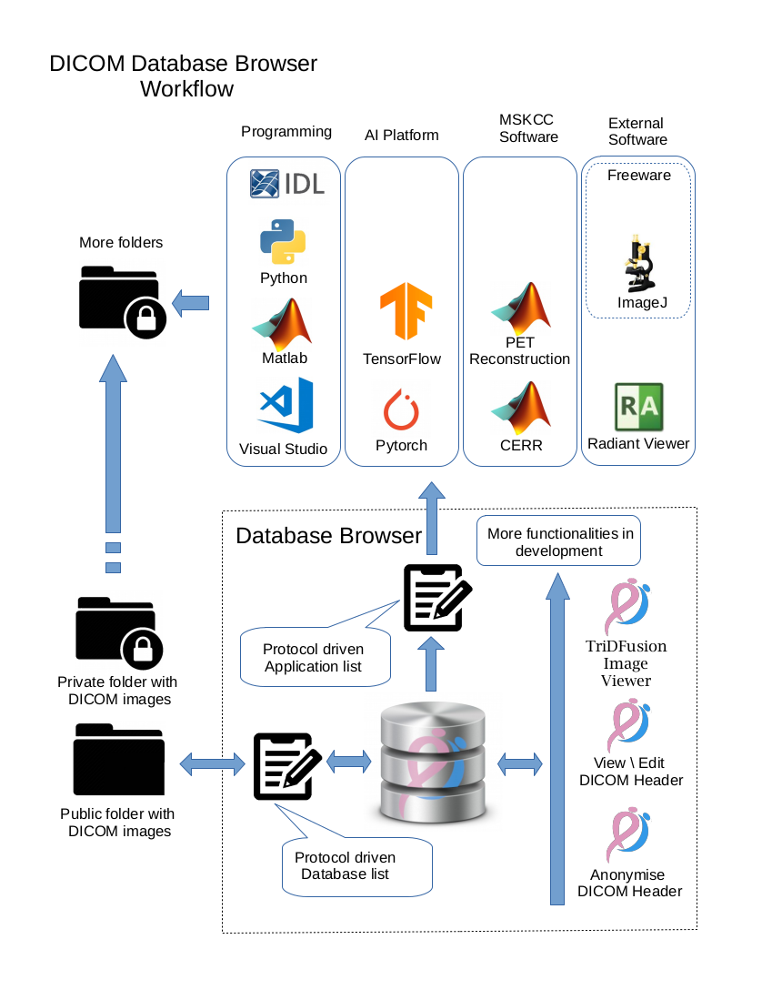

  <h1>DICOM Database Browser</h1>
  
<strong>The DICOM Database Browser</strong> is a a DICOM series browser for research provided by <a href="https://daniellafontaine.com/">Daniel Lafontaine</a>.

## Features:

* No limit of capacity data storage
* Protocol driven database & applications list. DICOM Database Browser allows a typical research department to start their own developed applications
* Series are stored in their original format with no modification 
* DICOM Series Anonymizer
* Multi-Modality DICOM Editor with configurable dictionary
* DICOM Multi-Modality & Multidimensional Image Viewer

## Requirement:

* MATLAB Runtime 2020a (9.8):
* https://www.mathworks.com/products/compiler/matlab-runtime.html

## Optional:

* https://github.com/dicomtools/TriDFusion
* https://github.com/dicomtools/DicomMultiFilesEditor

See https://daniellafontaine.com/ for more information
